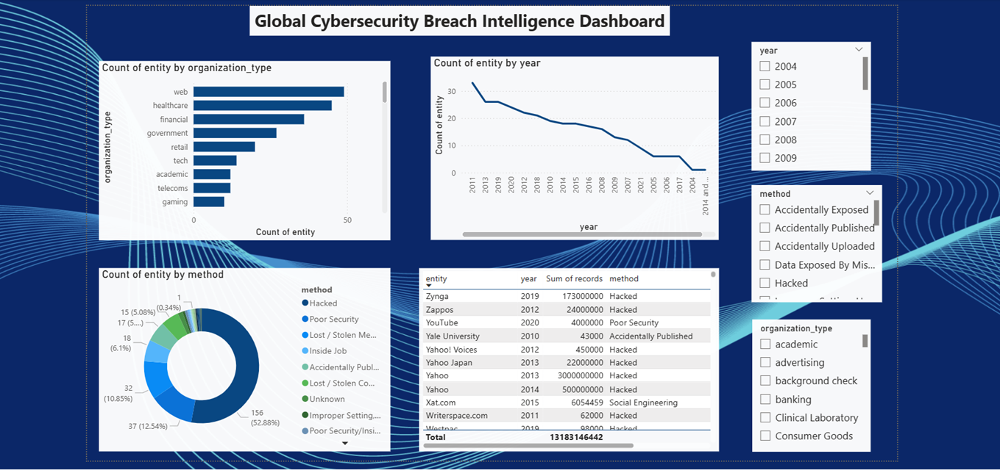

# 🔐 Global Cybersecurity Breach Intelligence Dashboard

## 🔗 Live Dashboard
[👉 Click here to view live interactive dashboard](https://app.powerbi.com/links/dtIavaVtKQ?ctid=bf93bb5e-ecf0-4e3d-be0e-79b5cc527a48&pbi_source=linkShare)

## Business Question
Which industries are most vulnerable to cyberattacks, and how have breach patterns evolved from 2004–2021?

## Dataset
- Source: Kaggle — World's Biggest Data Breaches
- Size: 295 records across 54 industries (2004–2021)

## Tools Used
- Python (Pandas, Matplotlib, Seaborn, Plotly)
- SQL (SQLite)
- Power BI (Interactive Dashboard)

## Key Findings
- Web industry had the most breaches (49 — 16.61% of total)
- Healthcare second most targeted (45 — 15.25%)
- Hacking was the most common attack method (52.88%)
- Peak breach year was 2011 with 34 incidents

## Project Structure
- `notebooks/` — Python data cleaning and EDA
- `sql/` — SQL analysis queries
- `outputs/` — All generated charts
- `data/` — Raw and cleaned datasets
